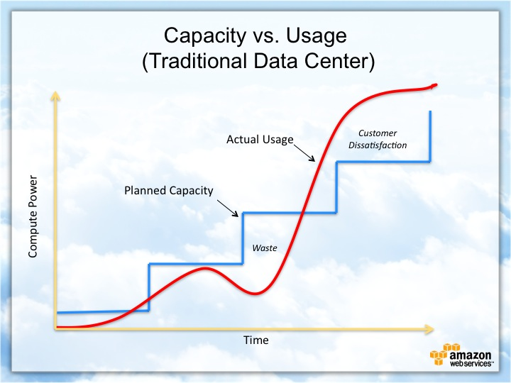
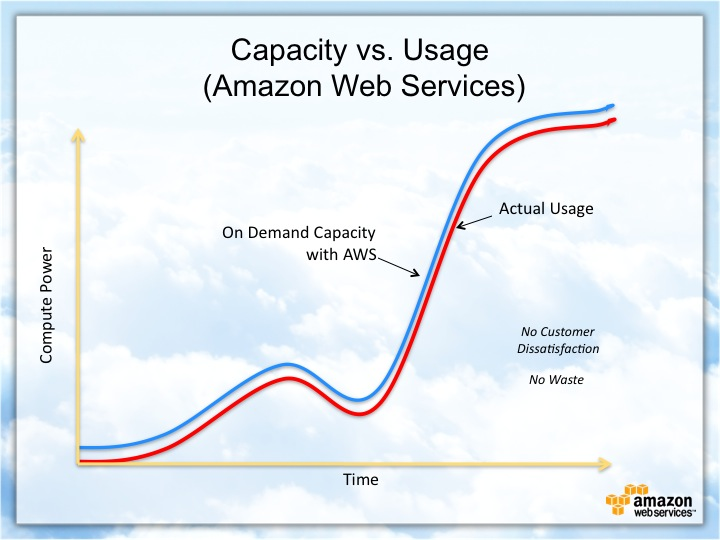

class: center, middle

# Microsoft Azure

## -en introduksjon

---

# Dagsorden

1. Nettskyen
2. Serverless
3. Azure function - node.js
4. ASP.NET

---

class: center,middle

# Serverless computing

---
class: center,middle

# Kapasitet - tradisjonelt



---
class: center,middle

# Kapasitet - serverless



---

# Hva er Azure functions?

* _Serverless computing_ til det ekstreme
* Sammenlignbar med Amazons _AWS Lambda_
* Kjennetegn
  * Betaler per invokasjon/eksevering (Azure: ulike modeller)
  * En _funksjon_ er en selvstendig enhet

---

class: center,middle

# Azure-økosystemet


---

class: center,middle

# Ressurser i Azure


---

# Kjernefunksjonalitet

* Språk:
  * JavaScript (node)
  * C# (.NET Framework og .NET Core)
  * F# (.NET Framework og .NET Core)
  * Java
* _Bindings_
* Tilgangsstyring
  * _API Key_ (enkel)
  * OAuth2 via Azure AD (avansert)

---

# Hvorfor bruke funktions?

* _Pay-as-you-go_
* "Lim" mellom tjenester eller komponenter
* Hendelsesbasert (_event driven_)
* Mindre, selvstendig funksjonalitet

---

class: center,middle

## Eksempel - enkel funksjon


---

class: center,middle

## Eksempel - sammensatte funksjoner


---

class: center,middle

# Triggers & Bindings

[.pure-table.pure-table-bordered.pure-table-striped.smaller-font[

|Type                  |Service           |Trigger    |Input    |Output     |
|----------------------|------------------|-----------|---------|-----------|
|Schedule              |Azure Functions   |&#10004;   |&nbsp;   |&nbsp;     |
|HTTP (REST or webhook)|Azure Functions   |&#10004;   |&nbsp;   |&#10004;   |
|Blob storage          |Azure storage     |&#10004;   |&#10004; |&#10004;   |
|Events                |Azure Event hubs  |&#10004;   |&nbsp;   |&#10004;   |
|Queues                |Azure storage     |&#10004;   |&nbsp;   |&#10004;   |
|Queues and topics     |Azure service bus |&#10004;   |&nbsp;   |&#10004;   |
|Storage tables        |Azure storage     |&nbsp;     |&#10004; |&#10004;   |
|SQL tables            |Azure Functions   |&nbsp;     |&#10004; |&#10004;   |
|NoSQL DB              |Azure Functions   |&#10004;   |&#10004; |&#10004;   |
|Push Notifications    |Azure Functions   |&nbsp;     |&nbsp;   |&#10004;   |
|Twilio SMS Text       |Azure Functions   |&nbsp;     |&nbsp;   |&#10004;   |
|SendGrid email        |Azure Functions   |&nbsp;     |&nbsp;   |&#10004;   |
|Excel tables          |Azure Functions   |&nbsp;     |&#10004; |&#10004;   |
|OneDrive files        |Azure Functions   |&nbsp;     |&#10004; |&#10004;   |
|Outlook email         |Azure Functions   |&nbsp;     |&nbsp;   |&#10004;   |
|Microsoft Graph events|Azure Functions   |&#10004;   |&#10004; |&#10004;   |
|Auth tokens           |Azure Functions   |&nbsp;     |&#10004; |&nbsp;     |
]

---

# Webhook - function.json

```json
{
  "disabled": false,
  "bindings": [
    {
      "authLevel": "function",
      "type": "httpTrigger",
      "direction": "in",
      "name": "req"
    },
    {
      "type": "http",
      "direction": "out",
      "name": "res"
    }
  ]
}
```

---

# Timer trigger - function.json

```json
{
  "configurationSource": "attributes",
  "bindings": [
    {
      "type": "timerTrigger",
      "schedule": "0 0 7 * * 1-5",
      "useMonitor": true,
      "runOnStartup": false,
      "name": "myTimer"
    }
  ],
  "disabled": false,
  "scriptFile": "../bin/BredvidFuncs.dll",
  "entryPoint": "BredvidFuncs.SlackBot.InitiateCheckChannels.Run"
}
```

---

# Queue trigger - function.json

```json
{
  "bindings": [
    {
      "type": "queueTrigger",
      "queueName": "channels-to-check",
      "name": "channelToCheck"
    }
  ],
  "disabled": false,
  "scriptFile": "../bin/BredvidFuncs.dll",
  "entryPoint": "BredvidFuncs.SlackBot.FindNonResponders.Run"
}
```
